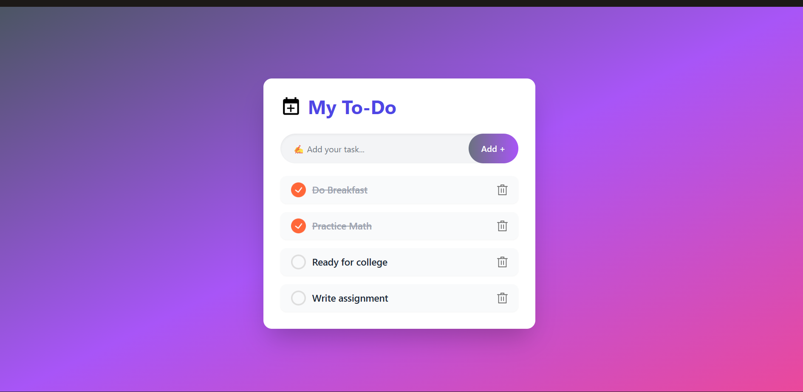

# Todo App (React + Vite)

A simple and efficient Todo application built using **React** and **Vite**. Easily manage your daily tasks with add, delete, and mark-as-complete features. Lightning-fast development and performance thanks to Vite!

---

## 🚀 Features

- Add new todos
- Delete existing todos
- Mark todos as completed
- Responsive UI
- Fast build & hot-reload with Vite

---

## 📦 Getting Started

Follow these steps to set up the project locally:

### 1. Clone the repository

```bash
git clone https://github.com/Shreya-231/Todo_app.git
cd Todo_app
```

### 2. Install dependencies

```bash
npm install
```

### 3. Start the development server

```bash
npm run dev
```

Open [http://localhost:5173](http://localhost:5173) in your browser to view the app.

---

## 🖼️ Screenshot

Below is a screenshot of the Todo App interface:



*If you don’t see the screenshot, make sure `screenshot.png` is present in the project root.*

---

## 🛠️ Built With

- [React](https://react.dev/)
- [Vite](https://vitejs.dev/)
- [JavaScript]
- [CSS]

---

## 📄 License

This project is licensed under the MIT License.

---

## 👩‍💻 Author

- **Shreya-231**  
  [GitHub Profile](https://github.com/Shreya-231)

---

Enjoy building your tasks! 🎉
